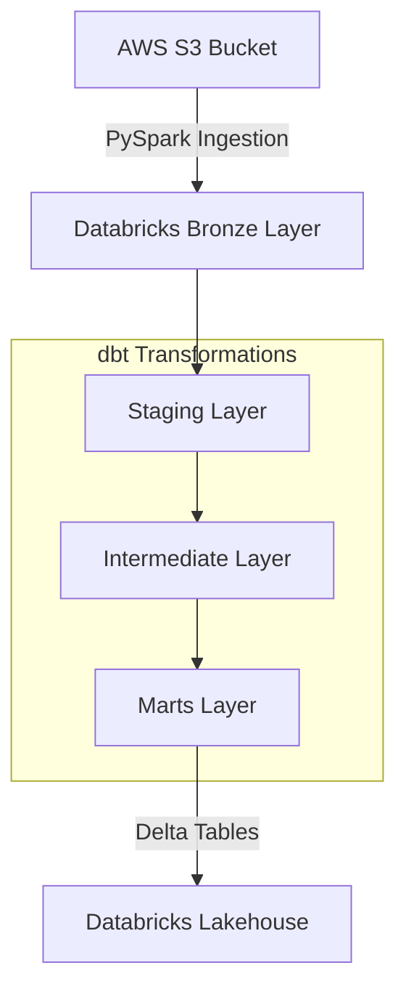

# ShopFlow 🛍️

Engineering an end-to-end e-commerce Lakehouse using **Databricks (Delta Lake)** and **dbt**, reducing transformation compute costs.

---

## 🏗️ Architecture & Data Flow

The data pipeline processes raw e-commerce transaction data through a multi-hop lakehouse architecture, starting from cloud storage all the way to analytics-ready dimension and fact tables. The entire pipeline is orchestrated via **Databricks Jobs**.



### 1. 📥 Ingestion Phase (AWS S3 to Bronze)
* **Storage Source:** Raw e-commerce datasets (customers, orders, reviews, etc.) are hosted on an **AWS S3 Bucket**.
* **Ingestion Logic:** Handled inside Databricks using PySpark in the [bronze.ipynb](file:///C:/Users/Łukasz/ShopFlow/ingestion/bronze.ipynb) notebook.
* **Storage Format:** Raw CSVs are read and written into Delta tables under the `shopflow.bronze` schema (Delta Lake).

### 2. 🔄 Transformation Phase (dbt)
The transformation layer is managed by dbt (data build tool) inside the `transform` directory:
* **Staging Layer (`stg_`):** Standardizes raw columns, casts data types using robust functions like `try_cast` (to prevent ANSI exceptions on malformed rows), and formats string columns. Configured as views.
* **Intermediate Layer (`int_`):** Performs deduplication, joins, and aggregations (such as grouping geolocation coordinates and summarizing order details). Configured as views.
* **Marts Layer (`dim_` / `fct_`):** Final dimensional model tables containing ready-to-consume fact and dimension tables (e.g. `dim_customers`, `fct_orders`). Materialized as physical Delta tables in Databricks.

### 3. 🎯 Orchestration (Databricks Jobs)
All tasks in the pipeline are wrapped and automated using **Databricks Workflows / Jobs**:
1. **Task 1 (Ingestion):** Executes the Spark notebooks to refresh the raw Bronze layer.
2. **Task 2 (Transformation):** Executes `dbt build` to build and test the staging, intermediate, and marts layers.

---

## 🛠️ Getting Started Locally

### Prerequisites
* Python 3.10+
* Access to a Databricks Workspace SQL Warehouse

### Setup
1. Clone the repository and navigate to the project directory.
2. Activate the virtual environment:
   ```powershell
   .\venv\Scripts\activate
   ```
3. Install dependencies:
   ```bash
   pip install -r requirements.txt
   ```
4. Verify the dbt connection:
   ```bash
   cd transform
   dbt debug
   ```
5. Compile and run the pipeline:
   ```bash
   dbt build
   ```

---

## 🧪 CI/CD
A GitHub Actions workflow is configured in [dbt_ci.yml](file:///C:/Users/Łukasz/ShopFlow/.github/workflows/dbt_ci.yml) to automatically validate and test dbt models on every pull request to ensure that no schema or data quality issues are introduced.
